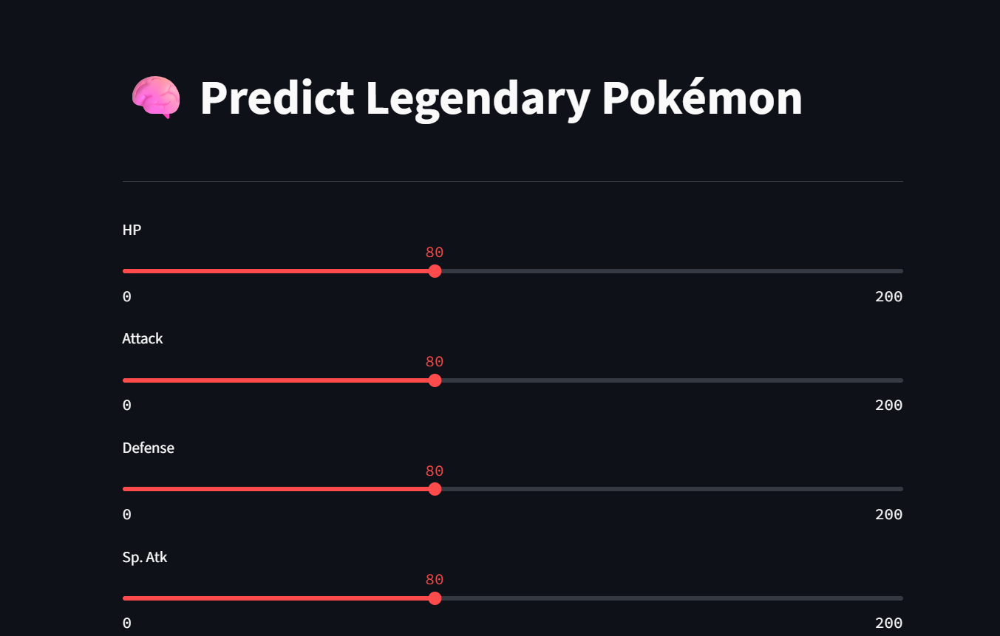

# 🧠 Legendary Pokémon Predictor

This Streamlit app predicts whether a Pokémon is Legendary based on its base stats using a machine learning model (XGBoost). It also provides visual insights into the Pokémon dataset.

## 🔍 Features

- 📊 Data Visualization (stat distributions, correlation heatmap, pie chart)
- 🔮 Prediction tool using trained XGBoost model
- 📈 Model performance: Confusion Matrix & Classification Report

## 📂 Dataset

- Source: [Kaggle - Pokémon with stats](https://www.kaggle.com/datasets/abcsds/pokemon)

## 🧠 Model Info

- Trained using: `HP`, `Attack`, `Defense`, `Speed`, `Sp. Atk`, and `Sp. Def`
- Model: XGBoost Classifier with `scale_pos_weight` for class imbalance
- Evaluation: 5-fold Cross-Validation using F1-score

## 🚀 Tech Stack

- Python, Streamlit, XGBoost, pandas, seaborn, matplotlib

## 📎 Demo

🔗 [Live App](https://legendary-pokemon-predictor.streamlit.app)  

---

## 📸 Screenshots

## 📜 License

This project is licensed under the **MIT License** – see the [LICENSE](LICENSE) file for details.

---

## 🙋 Author

Built with ❤️ by **Laksh Arora**  
- 🔗 [GitHub Profile](https://github.com/lakshhttps)
- 💼 [LinkedIn](https://www.linkedin.com/in/laksh-arora-490ba725b/)
- 🐦 [X (Twitter)](https://x.com/hacknhash)
